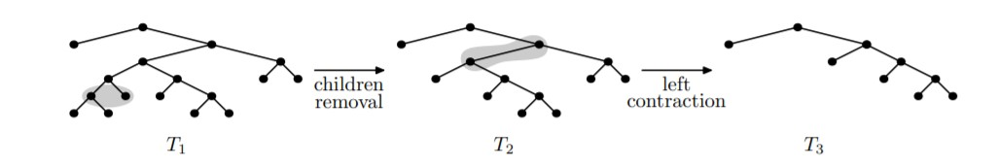
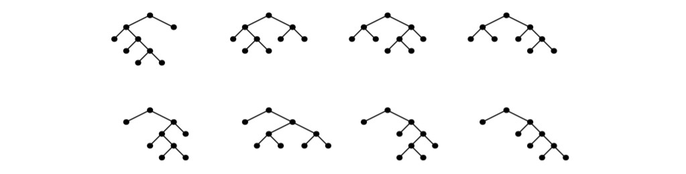

# Лабораторная работа по производящим функциям

## Задача A. Операции с многочленами

Имя входного файла: стандартный ввод

Имя выходного файла: стандартный вывод

Ограничение по времени: 2 секунды

Ограничение по памяти: 256 мегабайт

Даны два многочлена _P_ и _Q_:

_P(t)_ = p_0 + p_1 * t+...+ p_n * t_n

_Q(t)_ = q_0 + q_1 * t +...+ q_m * t_m

Найдите _P(t)_ + _Q(t)_, _P(t)_ * _Q(t)_ и первые 1000 коэффициентов ряда _P(t)_/_Q(t)_. Все вычисления необходимо производить по модулю 998 244 353.

### Формат входных данных

В первой строке содержатся числа _n_ и _m_ ( 1 ⩽ _n_, _m_ ⩽ 1000 ) — степени многочленов _P_ и _Q_.

Вторая строка содержит _n_ + 1 число p_0, p_1,..., p_n — коэффициенты многочлена _P_
( 0 ⩽ p_i < 998 244 353), гарантируется, что p_n > 0.

Третья строка содержит _m_ + 1 число q_0, q_1,..., q_m — коэффициенты многочлена _Q_
( 0 ⩽ q_i <998 244 353), гарантируется, что q_0 = 1 и q_m > 0.

### Формат выходных данных

В первой строке выведите степень многочлена _P_ + _Q_, во второй строке выведите его коэффициенты. Если многочлен не равен тождественно нулю, то старший коэффициент должен быть
ненулевым, степень многочлена, тождественно равного нулю, считается равной 0.

В третьей строке выведите степень многочлена _P_ * _Q_, во четвертой строке выведите его коэффициенты, старший коэффициент должен быть ненулевым.

В последней строке выведите 1000 первых коэффициентов _P(t)_/_Q(t)_.

### Примеры

**стандартный ввод**
```
3 2
0 1 2 3
1 2 3
```

**стандартный вывод**
```
3
1 3 5 3
5
0 1 4 10 12 9
0 1 0 ... 0
```

**стандартный ввод**
```
1 3
1 2
1 4 5 2
```

**стандартный вывод**
```
3
2 6 5 2
4
1 6 13 12 4
1 998244351 3 ... 999 998243353
```

### [Решение](A.cpp)

## Задача B. Операции с многочленами — 2


Имя входного файла: стандартный ввод

Имя выходного файла: стандартный вывод

Ограничение по времени: 2 секунды

Ограничение по памяти: 256 мегабайт

Дан многочлен _P_ степени _n_ со нулевым свободным членом:

_P(t)_ = p_1 * t +...+ p_n * tn

Найдите первые _m_ коэффициентов √(1 + _P(t)_), e^*P(t)* и ln(1 + _P(t)_). Все вычисления необходимо
производить по модулю 998 244 353.

### Формат входных данных

В первой строке содержатся числа _n_ и _m_( 1 ⩽ _n_, _m_ ⩽ 100 ) — степень многочлена _P_ и необходимое
количество коэффициентов.

Вторая строка содержит _n_ + 1 число p_0, p_1,..., p_n — коэффициенты многочлена _P_
( 0 ⩽ p_i < 998 244 353), гарантируется, что p_n > 0 и p_0 = 0.

### Формат выходных данных

Выведите три строки. В первой строке выведите первые _m_ коэффициентов ряда √(1 + _P(t)_),
соответствующие степеням t^0 , t^1,... , t^m-1. В следующих двух строчках в аналогичном формате
выведите коэффициенты e^*P(t)* и ln(1 + _P(t)_) по модулю 998 244 353.

### Пример

**стандартный ввод**
```
1 4
0 1
```

**стандартный вывод**
```
1 499122177 124780544 935854081
1 1 499122177 166374059
0 1 499122176 332748118
```

### Замечание

Дробь _a_/_b_ mod _m_ следует вычислять, как _a_**b*^-1 mod _m_, где _b_^-1 обозначает обратный по модулю
_m_ элемент к _b_: _bb_^-1 mod _m_= 1.

Например, √(1 + t) = 1 + _t_/2 − *t*^2/8 + *t*^3/16 + . . .. 1/2 mod _M_ = 1 * 2^-1 mod _M_ = 499122177 и 1/8 = 1 * 6^-1 mod _M_ = 124780544.

### [Решение](B.cpp)

## Задача C. Подсчет деревьев

Имя входного файла: стандартный ввод

Имя выходного файла: стандартный вывод

Ограничение по времени: 2 секунды

Ограничение по памяти: 256 мегабайт

Заданы числа c_1, c_2,..., c_k. Посчитайте количество различных бинарных деревьев, в которых
вершины могут иметь вес c_i. Вершины равного веса считаются одинаковыми.

### Формат входных данных

В первой строке содержатся два целых числа _k_ и _m_ ( 1 ⩽ _k_, _m_ ⩽ 2 000) — количество весов
вершин и максимальный вес дерева. В следующей строке содержатся числа c_i ( 1 ⩽ c_i ⩽ _m_). Все c_i
различны.

### Формат выходных данных

Выведите _m_ чисел — количество деревьев веса 1, 2,..., _m_ по модулю 10^9 + 7.

### Примеры

**стандартный ввод**
```
2 5
1 3
```

**стандартный вывод**
```
1 2 6 18 57
```

**стандартный ввод**
```
1 10
2
```

**стандартный вывод**
```
0 1 0 2 0 5 0 14 0 42
```

### [Решение](C.cpp)

## Задача D. Конструируемые комбинаторные классы

Имя входного файла: стандартный ввод

Имя выходного файла: стандартный вывод

Ограничение по времени: 2 секунды

Ограничение по памяти: 256 мегабайт

В этой задаче мы используем следующие способы конструирования комбинаторных объектов.
Базовое множество _B_ состоит из одного объекта _u_ с весом 1. Каждый сконструированный объект
_x_ имеет некоторый вес _w(x)_. Если объект сконструирован из одного или нескольких других объектов,
его вес равен сумме весов этих объектов.

Пусть _X_ задаёт некоторое множество комбинаторных объектов. Рассмотрим следующие способы
создать новые множества объектов.

Множество _L(X)_ состоит из всех возможных списков конечной длины, каждый элемент которых
имеет положительный вес и принадлежит множеству _X_. Например, _L(B)_ состоит из списков [], [u],
[u, u], [u, u, u], и так далее. Аналогично, _L(L(B))_ состоит из [], [[u]], [[u], [u]], [[u, u], [u]], [[u], [u, u]], и так
далее. Обратите внимание, последние два списка различны, поскольку для списка важен порядок
элементов в нем. Также обратите внимание, что [[]] не является корректным списком в _L(L(B))_,
поскольку только объекты положительного веса разрешаются в качестве элементов списков, а []
имеет вес 0.

Множество _S(X)_ содержит все возможные мультимножества конечного размера, каждый элемент которых имеет положительный вес и принадлежит _X_. Например, _S(B)_ состоит из мультимножеств {}, {u}, {u, u}, {u, u, u}, и так далее. Еще один пример: _S(L(B))_ содержит, например, мультимножества {[u]}, {[u], [u]}. Обратите внимание, что мультимножество может содержать несколько
равных объектов. Заметьте, что в отличие от списков для мультимножеств не важен порядок элементов, поэтому мультимножество {[u], [u, u]} совпадает с мультимножеством {[u, u], [u]}.
Вес списка или мультимножества равен сумме весов его элементов, например, вес
([u], [u; u], [u, u, u]) равен 6.

Наконец, последний рассматриваемый способ создания нового типа комбинаторных объектов —
пара. Если _X_ и _Y_ — множества комбинаторных объектов, то _P(X, Y)_ представляет собой множество упорядоченных пар объектов, где первый компонент взят из _X_, а второй — из _Y_. Например,
_P(S(B)_, _L(B))_ содержит в качестве элементов ⟨{u, u}, [u, u, u]⟩ и ⟨{}, [u]⟩. Обратите внимание, что в
отличие от списков, мультимножеств и циклов, пары могут содержать компоненты нулевого веса.
По заданному описанию класса комбинаторных объектов посчитайте количество элементов веса
0, 1, 2, 3, 4, 5 и 6.

### Формат входных данных

В единственной строке входного файла содержится корректное описание комбинаторного объекта. Длина описания не превосходит 200.

### Формат выходных данных

Выведите семь целых чисел — количество объектов в описанном комбинаторном классе с весом
от 0 до 6.

### Примеры

**стандартный ввод**
```
P(S(B),L(B))
```

**стандартный вывод**
```
1 2 3 4 5 6 7
```

**стандартный ввод**
```
S(L(B))
```

**стандартный вывод**
```
1 1 2 3 5 7 11
```

**стандартный ввод**
```
L(P(L(L(L(P(P(P(B,L(B)),L(B)),P(B,L(B)))))),P(B,L(B))))
```

**стандартный вывод**
```
1 1 2 5 14 42 132
```

### [Решение](D.cpp)

## Задача E. Деревья, избегающие левых расчёсок

Имя входного файла: стандартный ввод

Имя выходного файла: стандартный вывод

Ограничение по времени: 2 секунды

Ограничение по памяти: 512 мегабайт

Структуры, избегающие определенных подструктур, активно изучаются в комбинаторике. В этой
задаче мы изучим деревья, избегающие определенных поддеревьев.
Рассмотрим подвешенное двоичное дерево, в котором каждая вершина имеет ровно двух детей:
левого и правого (внутренняя вершина), или не имеет ни одного ребенка (лист). В особом случае
дерева из одной вершины его корень также считается листом.
Будем говорить, что дерево _T_ стягивается к дереву _R_, если _R_ можно получить из _T_ последовательностью следующих операций:

* Удаление детей: удалить оба поддерева у внутренней вершины, превратив ее в лист.

* Левое стягивание: пусть _y_ — левый сын _x_. Заменим детей _x_ на детей _y_.

* Правоестягивание: пусть _y_ — правый сын _x_. Заменим детей _x_ на детей _y_.

Дерево _T_ избегает дерева _R_, если _T_ не стягивается к дереву _R_.
Рисунок ниже показывает описанные операции, также он демонстрирует, что дерево T_1 стягивается к дереву T_3.



Левой расческой порядка _k_ называется дерево с _k_ листьями, где правый сын любой вершины
представляет собой лист. На рисунке ниже показаны левые расчески порядка _k_ для _k_ от 2 до 5.


По заданному _k_ и _n_ вычислите для всех _i_ от 1 до _n_ количество деревьев с _i_ листьями, избегающих
левых расчесок порядка _k_. Выведите эти числа по модулю 998 244 353.

Все деревья с 5 листьями, избегающие левых расчесок порядка 4, показаны на рисунке.



### Формат входных данных

На вход подаётся два числа: _k_ и _n_ ( 2 ⩽ _k_ ⩽ 5000 , 1 ⩽ _n_ ⩽ 5000 ).

### Формат выходных данных

Выведите _n_ целых чисел: для каждого _i_ от 1 до _n_ выведите число деревьев с _i_ листьями, избегающих левых расчесок порядка _k_, выводите числа по модулю 998 244 353.

### Примеры

**стандартный ввод**
```
4 5
```

**стандартный вывод**
```
1
1
2
4
8
```

**стандартный ввод**
```
7 6
```

**стандартный вывод**
```
1
1
2
5
14
42
```
 
### [Решение](E.cpp) 
 
# Задача F. Генератор случайных чисел

Имя входного файла: стандартный ввод

Имя выходного файла: стандартный вывод

Ограничение по времени: 2 секунды

Ограничение по памяти: 256 мегабайт

Одним из возможных способов написать генератор случайных чисел являются линейные рекурренты.

Рассмотрим следующую линейную рекурренту:
A_i = (A_i-1 C_1 + A_i-2 C_2 +...+ A_ik C_k) mod 104857601, где _i_ ⩾ _k_ + 1
Вам даны начальные значенияA 1, A_2,..., A_k, а также коэффициенты рекурренты C_1, C_2,..., C_k.
Вычислите A_n, для заданного _n_.

### Формат входных данных

В первой строке дано число _k_ ( 1 ⩽ _k_ ⩽ 1000 ), и число _n_ ( 1 ⩽ _n_ ⩽ 10^18 ).

Вторая строка содержит ровно _k_ чисел: A_1, A_2,..., A_k( 0 ⩽ A_i < 104857601 ).

В третьей строке записаны ровно _k_ чисел: C_1, C_2,..., C_k ( 0 ⩽ C_i < 104857601 ).

### Форматвыходныхданных

Выведите одно число — ответ на задачу.

### Пример

**стандартный ввод**
```
3 5
1 2 3
4 5 6
```

**стандартный вывод**
```
139
```

### [Решение](F.cpp)

